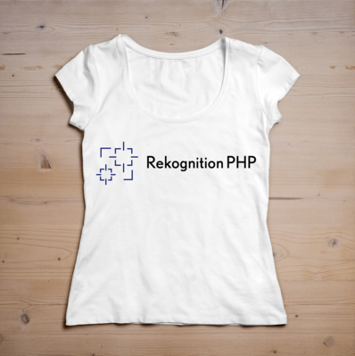
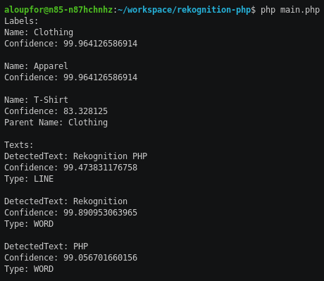

# Rekognition PHP - C&M

> Simple to use PHP library for [AWS Rekognition](https://aws.amazon.com/rekognition/).

[](https://circleci.com/gh/ClickAndMortar/rekognition-php)

`Rekognition PHP` allows to detect in images:

- **Labels** (using [DetectLabels](https://docs.aws.amazon.com/rekognition/latest/dg/API_DetectLabels.html))

 > Detects instances of real-world entities within an image (JPEG or PNG)
 provided as input. This includes objects like flower, tree, and table;
 events like wedding, graduation, and birthday party;
 and concepts like landscape, evening, and nature.

- **Text** (using [DetectText](https://docs.aws.amazon.com/rekognition/latest/dg/API_DetectText.html))

> Detects text in the input image and converts it into machine-readable text.

 

## Installation

```shell
composer require clickandmortar/rekognition-php
```

## Configuration

### Configure credentials

Before using `rekognition-php`, [set credentials to make requests to Amazon Web Services](https://docs.aws.amazon.com/sdk-for-php/v3/developer-guide/guide_credentials.html).

## Usage

The following code will allow to retrieve the output from
previous picture:

```php
<?php

use ClickAndMortar\Rekognition\Service\DetectService;

require 'vendor/autoload.php';

$detectService = new DetectService();

$url = 'https://raw.githubusercontent.com/ClickAndMortar/rekognition-php/master/img/tshirt.png';
$rekognitionImage = $detectService->detectFromUrl($url);
$minimumConfidence = 80;

print 'Labels:' . PHP_EOL;
foreach ($rekognitionImage->getLabels($minimumConfidence) as $label) {
    print $label;
}

print 'Texts:' . PHP_EOL;
foreach ($rekognitionImage->getTexts($minimumConfidence) as $text) {
    print $text;
}

```

Output will be the same if:

```php
$url = 'https://raw.githubusercontent.com/ClickAndMortar/rekognition-php/master/img/tshirt.png';
$rekognitionImage = $detectService->detectFromUrl($url);
```

is replaced with:

```php
$filename = 'img/tshirt.png';
$handle = fopen($filename, 'r');
$image = fread($handle, filesize($filename));
fclose($handle);

$rekognitionImage = $detectService->detect($image);
```

or

```php
$filename = 'img/tshirt.png';
$handle = fopen($filename, 'r');
$image = fread($handle, filesize($filename));
fclose($handle);

$base64image = base64_encode($image);
$rekognitionImage = $detectService->detectFromBase64($base64image);
```

## Advanced configuration (Optional)

### Configure Rekognition client options

Configuring Rekognition client options is optional as default values will
be used if none are set with the following methods.

[region](https://docs.aws.amazon.com/sdk-for-php/v3/developer-guide/guide_configuration.html#cfg-region)
and [version](https://docs.aws.amazon.com/sdk-for-php/v3/developer-guide/guide_configuration.html#cfg-version)
are configurable using environment variables `AWS_REGION` and
`AWS_REKOGNITION_VERSION`.

It is also possible to pass this options to `DetectService` constructor:
```php
$detectService = new DetectService([
    'region' => 'eu-west-1',
    'version' => '2016-06-27',
]);
```

## Tests

### Run tests

```shell
vendor/bin/phpunit
```

## Docker

### Installation

```shell
docker run --rm -it -v $PWD:/app composer install
```

### Run

Create `main.php` with code from [Usage](#usage).

```shell
docker run --rm -it -e AWS_ACCESS_KEY_ID="$AWS_ACCESS_KEY_ID" -e AWS_SECRET_ACCESS_KEY="$AWS_SECRET_ACCESS_KEY" -v "$PWD":/app -w /app php:7.1-cli php main.php
```

### Run tests

```shell
docker run --rm -it -e AWS_ACCESS_KEY_ID="$AWS_ACCESS_KEY_ID" -e AWS_SECRET_ACCESS_KEY="$AWS_SECRET_ACCESS_KEY" -v "$PWD":/app -w /app php:7.1-cli vendor/bin/phpunit
```
